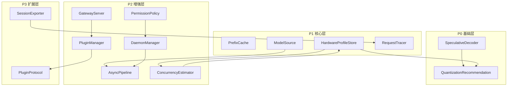

# ToshLLM 优化模块 API 文档

> 生成日期：2026-09-15  
> 适用版本：优化 roadmap 完成后

---

## 目录

- [模块依赖关系图](#模块依赖关系图)
- [P0 模块](#p0-模块)
- [P1 模块](#p1-模块)
- [P2 模块](#p2-模块)
- [P3 模块](#p3-模块)

---

## 模块依赖关系图



---

## P0 模块

### 1. SpeculativeDecoder

**文件**: `Sources/Hardware/SpeculativeDecoder.swift`

#### 协议

```swift
protocol SpeculativeDecoder {
    var name: String { get }
    var type: SpeculativeType { get }
    
    func configure(settings: SpeculativeSettings) throws
    func predict(context: [String]) -> [String]
    func validate(draft: [String], target: [String]) -> SpeculativeResult
    func benchmarkDraftAcceptance(modelPath: String) async -> Double
}
```

#### 枚举

```swift
enum SpeculativeType {
    case mtp          // Multi-Token Prediction
    case dflash       // Draft Model Acceleration
}

struct SpeculativeResult {
    let acceptedTokens: Int
    let totalDraftTokens: Int
    let acceptanceRate: Double
}
```

#### 使用示例

```swift
let decoder = MTPDecoder()
try decoder.configure(settings: .init(enabled: true, draftLayers: 4))
let result = decoder.validate(draft: ["hello", "world"], target: ["hello", "world", "!"])
print("Acceptance rate: \(result.acceptanceRate)")
```

---

### 2. QuantizationRecommendation

**文件**: `Sources/Hardware/QuantizationRecommendation.swift`

#### 结构体

```swift
struct QuantizationRecommendation {
    let tier: QuantizationTier
    let reason: Reason
    let estimatedSizeGB: Double
    let estimatedSpeed: Double
    let fitsInVRAM: Bool
    let alternatives: [QuantizationTier]
    
    static func recommend(
        modelSizeGB: Double,
        modelLayers: Int,
        isMoE: Bool,
        hardware: HardwareInfo
    ) -> QuantizationRecommendation
}

enum QuantizationTier: String, CaseIterable {
    case q4_0 = "Q4_0"
    case f16 = "F16"
}
```

#### 使用示例

```swift
let recommendation = QuantizationRecommendation.recommend(
    modelSizeGB: 4.5,
    modelLayers: 32,
    isMoE: false,
    hardware: HardwareInfo.detect()
)
print("Recommended: \(recommendation.tier.rawValue)")
```

---

## P1 模块

### 3. PrefixCache

**文件**: `Sources/Servers/PrefixCache.swift`

#### 结构体

```swift
struct PrefixCache {
    mutating func lookup(
        systemPrompt: String,
        toolDefs: [[String: Any]],
        prefixTokens: [String]
    ) -> CachedPrefix?
    
    mutating func store(
        systemPrompt: String,
        toolDefs: [[String: Any]],
        prefixTokens: [String],
        result: CachedPrefix
    )
}

struct CachedPrefix {
    let kvData: Data
    let tokenCount: Int
    let createdAt: Date
}
```

---

### 4. HardwareProfileStore

**文件**: `Sources/Hardware/HardwareProfileStore.swift`

#### 结构体

```swift
struct HardwareProfile: Codable, Identifiable {
    let id: UUID
    let name: String
    let cpuBrand: String
    let physicalCores: Int
    let ramGB: Double
    let gpus: [GPUProfile]
    let supportsUnifiedMemory: Bool
    let bandwidthGBs: Double
    let fp16TFLOPS: Double
}

struct GPUProfile: Codable {
    let name: String
    let vramGB: Int
    let computeUnits: Int
    let supportsBF16: Bool
}

class HardwareProfileStore: ObservableObject {
    func detect() -> HardwareProfile
    func findBestMatchingPreset() -> HardwareProfile?
    func save(_ profile: HardwareProfile)
    func export(_ profile: HardwareProfile) throws -> Data
    func importProfile(from data: Data) throws -> HardwareProfile
}
```

---

### 5. ModelSource

**文件**: `Sources/Models/ModelSource.swift`

#### 协议

```swift
protocol ModelSource {
    var name: String { get }
    var type: ModelSourceType { get }
    
    func list() async throws -> [ModelSourceItem]
    func search(query: String) async throws -> [ModelSourceItem]
    func download(item: ModelSourceItem, progress: @escaping (Double) -> Void) async throws -> URL
    func metadata(for item: ModelSourceItem) async throws -> ModelSourceMetadata
}

enum ModelSourceType {
    case local
    case huggingFace
    case ollama
    case openAICompatible
}
```

#### 使用示例

```swift
let localSource = LocalGGUFSource(path: "/path/to/models")
let models = try await localSource.search(query: "llama")
```

---

### 6. RequestTracer

**文件**: `Sources/Servers/RequestTracer.swift`

#### 结构体

```swift
class RequestTracer: ObservableObject {
    func traceStart(requestID: UUID) -> RequestTrace
    func traceEnd(requestID: UUID, result: TraceResult)
    func getTraces(for serverID: UUID?) -> [RequestTrace]
    func clearTraces()
}

struct RequestTrace: Identifiable {
    let id: UUID
    let serverID: UUID?
    let startTime: Date
    var endTime: Date?
    var tokenUsage: TokenUsage?
    var error: String?
}

struct TokenUsage {
    let promptTokens: Int
    let completionTokens: Int
    let tokensPerSecond: Double
}
```

---

## P2 模块

### 7. AsyncPipeline

**文件**: `Sources/Servers/AsyncPipeline.swift`

#### 结构体

```swift
actor AsyncPipeline {
    func downloadWithResume(
        from url: URL,
        to destination: URL,
        progress: @escaping (Double) -> Void
    ) async throws -> URL
    
    func inference(
        messages: [[String: String]],
        model: String?,
        stream: Bool
    ) async throws -> AsyncPipelineResponse
}

struct AsyncPipelineResponse {
    let content: String
    let tokenUsage: TokenUsage?
}
```

---

### 8. DaemonManager

**文件**: `Sources/Servers/DaemonManager.swift`

#### 类

```swift
@MainActor
class DaemonManager: ObservableObject {
    func start() async throws
    func stop()
    func restart() async throws
    func sendCommand(_ command: String) async throws -> String
    
    var status: DaemonStatus
    var lastError: String?
}

enum DaemonStatus {
    case stopped
    case starting
    case running
    case error
}
```

---

### 9. PermissionPolicy

**文件**: `Sources/Chat/PermissionPolicy.swift`

#### 结构体

```swift
struct PermissionPolicy {
    var globalLevel: Level
    var rules: [Rule]
    var allowPatterns: [String]
    var denyPatterns: [String]
    
    func checkPermission(
        operation: String,
        category: Category
    ) -> PermissionResult
    
    func riskSummary() -> RiskSummary
}

enum Level {
    case ask
    case allow
    case deny
}

enum Category {
    case fileRead
    case fileWrite
    case commandExecution
    case network
    case credentials
}

struct PermissionResult {
    let allowed: Bool
    let reason: String?
    let requiresApproval: Bool
}
```

---

### 10. ConcurrencyEstimator

**文件**: `Sources/Models/ConcurrencyEstimator.swift`

#### 结构体

```swift
struct ConcurrencyEstimator {
    static func estimate(
        spec: ModelSpec,
        hw: HardwareInfo,
        ctx: Int = 16384,
        kvScale: Double = 1.0,
        reservedGB: Double = 2.0
    ) -> Result
    
    static func quickEstimate(
        vramGB: Double,
        modelGB: Double,
        ctx: Int = 16384
    ) -> Int
    
    static func estimateRouter(
        models: [(spec: ModelSpec, count: Int)],
        hw: HardwareInfo,
        ctx: Int = 16384
    ) -> [String: Result]
}

struct Result {
    let maxSessions: Int
    let availableForKV: Double
    let kvPerSession: Double
    let tokensPerSecond: Double
    let memoryEfficiency: Double
    let isReliable: Bool
}
```

---

## P3 模块

### 11. SessionExporter

**文件**: `Sources/Chat/SessionExporter.swift`

#### 结构体

```swift
struct SessionExporter {
    static func exportJSON(conversation: Conversation) throws -> Data
    static func exportMarkdown(conversation: Conversation) throws -> String
    static func exportText(conversation: Conversation) throws -> String
    
    static func importJSON(from data: Data) throws -> Conversation
}

struct ExportedMessage: Codable {
    let role: String
    let content: String
    let timestamp: Date
    let tokenCount: Int?
}
```

---

### 12. PluginProtocol

**文件**: `Sources/Plugins/PluginProtocol.swift`

#### 协议

```swift
protocol Plugin: AnyObject, Sendable {
    var id: String { get }
    var name: String { get }
    var version: String { get }
    var description: String { get }
    var author: String { get }
    var dependencies: [String] { get }
    var capabilities: [PluginCapability] { get }
    
    func initialize(context: PluginContext) async throws
    func cleanup() async
    func handleEvent(_ event: PluginEvent) async throws
}

enum PluginCapability: String, Codable {
    case inferenceBackend
    case modelSource
    case tool
    case uiPanel
    case storage
    case network
}
```

---

### 13. PluginManager

**文件**: `Sources/Plugins/PluginManager.swift`

#### 类

```swift
@MainActor
class PluginManager: ObservableObject {
    func register(_ plugin: any Plugin)
    func loadAll() async
    func activate(id: String) async
    func deactivate(id: String)
    func unload(id: String) async
    func dispatchEvent(_ event: PluginEvent) async
    
    var plugins: [PluginEntry]
    var isLoaded: Bool
}
```

---

### 14. GatewayServer

**文件**: `Sources/Gateway/GatewayServer.swift`

#### 类

```swift
@MainActor
class GatewayServer: ObservableObject {
    func start() async throws
    func stop()
    func enableChannel(_ type: ChannelType) async throws
    func disableChannel(_ type: ChannelType)
    
    func processRequest(
        channel: ChannelType,
        messages: [[String: String]],
        model: String?,
        stream: Bool
    ) async throws -> GatewayResponse
    
    var status: Status
    var channels: [ChannelConfig]
}

enum ChannelType: String, CaseIterable {
    case openAI
    case webSocket
    case discord
    case slack
    case telegram
    case vscode
    case cline
}
```

---

## 已知限制

| 模块 | 限制 |
|------|------|
| GatewayServer | HTTP 服务器为空实现，需 NIO 或类似框架 |
| PluginManager | 插件发现为空实现，需实现 .toshplugin 加载 |
| MCPManager | `getServerCapabilities` 返回硬编码值 |
| AsyncPipeline | 硬编码 `http://127.0.0.1:8080` |
| SessionExporter | KV 缓存序列化为占位实现 |

---

## 相关文档

- [优化路线图](optimization-roadmap.md)
- [架构图](architecture-optimization.md)
