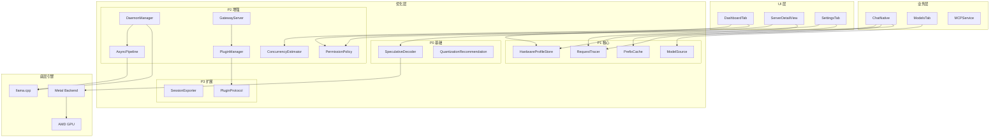
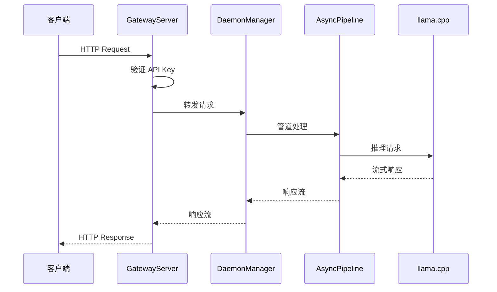
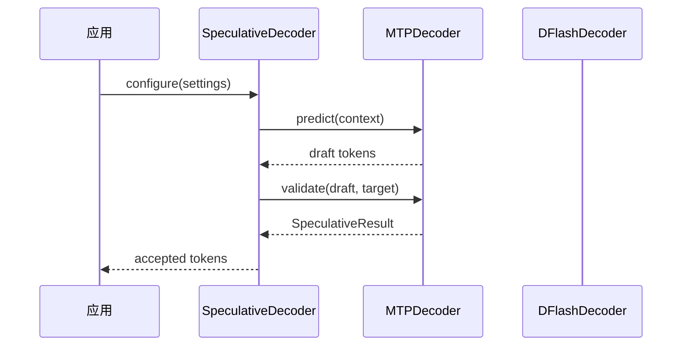
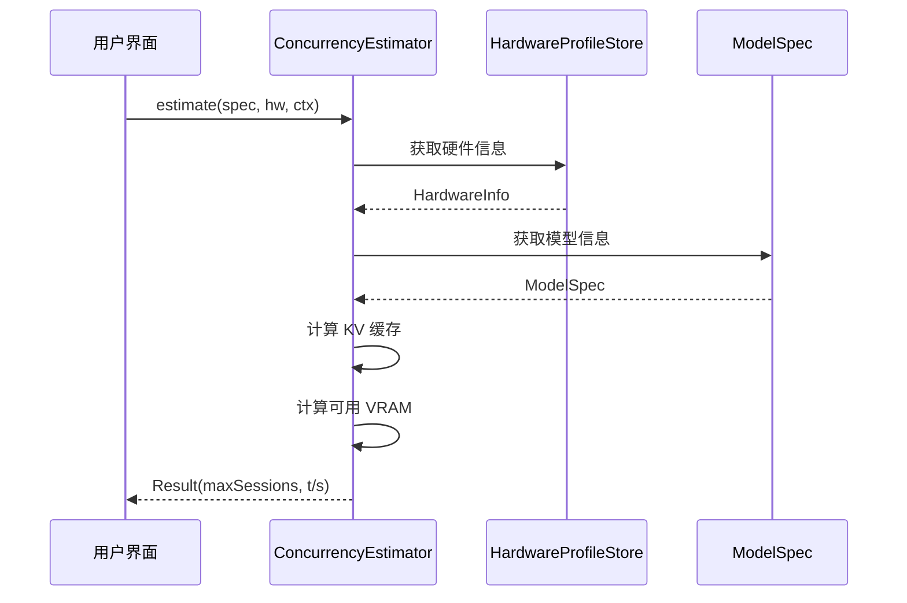

# ToshLLM 优化架构图

> 生成日期：2026-09-15

---

## 整体架构



---

## 数据流图

### 请求处理流程



### 推测解码流程



### 并发估算流程



---

## 模块间依赖

### 依赖矩阵

| 模块 | 依赖 | 被依赖 |
|------|------|--------|
| SpeculativeDecoder | - | ServerDetailView |
| QuantizationRecommendation | - | HardwareProfileStore |
| PrefixCache | - | ChatNative |
| HardwareProfileStore | - | ConcurrencyEstimator |
| ModelSource | - | ModelsTab, AsyncPipeline |
| RequestTracer | - | ServerDetailView, SessionExporter |
| AsyncPipeline | - | DaemonManager |
| DaemonManager | AsyncPipeline | GatewayServer |
| PluginManager | PluginProtocol | GatewayServer |
| GatewayServer | PluginManager | External Clients |
| PermissionPolicy | - | ChatNative, SettingsTab |
| ConcurrencyEstimator | HardwareProfileStore | DashboardTab |
| SessionExporter | RequestTracer | - |
| PluginProtocol | - | PluginManager |

---

## 集成点

### 1. Dashboard 集成

```swift
// DashboardTab.swift
struct DashboardMetricsView: View {
    @EnvironmentObject var hardware: HardwareMonitor
    
    var body: some View {
        // 添加并发估算卡片
        ConcurrencyCard(hw: hardware.info)
    }
}

struct ConcurrencyCard: View {
    let hw: HardwareInfo
    
    var body: some View {
        let result = ConcurrencyEstimator.estimate(
            spec: currentModel.spec,
            hw: hw
        )
        // 显示 maxSessions 和 tokensPerSecond
    }
}
```

### 2. ServerDetailView 集成

```swift
// ServerDetailView.swift
struct ServerPerformanceWorkspace: View {
    var body: some View {
        // 添加请求追踪面板
        RequestTracerView(serverID: server.id)
    }
}

struct RequestTracerView: View {
    @StateObject var tracer = RequestTracer()
    let serverID: UUID
    
    var body: some View {
        // 显示请求时间轴和 Token 用量
    }
}
```

### 3. Settings 集成

```swift
// SettingsTab.swift
struct SettingsView: View {
    var body: some View {
        // 添加权限策略设置
        PermissionPolicySection()
    }
}

struct PermissionPolicySection: View {
    @State var policy = PermissionPolicy()
    
    var body: some View {
        // 全局权限级别
        // 分类规则
        // 允许/拒绝模式
    }
}
```

---

## 性能优化点

### 1. PrefixCache

- **优化**: LRU 缓存淘汰策略
- **收益**: 减少 15-19k token 冷启动
- **文件**: `Sources/Servers/PrefixCache.swift`

### 2. AsyncPipeline

- **优化**: URLSession 连接池重用
- **收益**: 减少连接建立开销
- **文件**: `Sources/Servers/AsyncPipeline.swift`

### 3. RequestTracer

- **优化**: 字典替代数组存储
- **收益**: O(1) 查询替代 O(n)
- **文件**: `Sources/Servers/RequestTracer.swift`

### 4. ConcurrencyEstimator

- **优化**: 缓存计算结果
- **收益**: 避免重复计算
- **文件**: `Sources/Models/ConcurrencyEstimator.swift`

---

## 安全考虑

### 1. PermissionPolicy

- **措施**: Glob 模式匹配替代子串匹配
- **文件**: `Sources/Chat/PermissionPolicy.swift:112-116`
- **收益**: 防止路径遍历攻击

### 2. GatewayServer

- **措施**: API Key 验证中间件
- **文件**: `Sources/Gateway/GatewayServer.swift`
- **收益**: 防止未授权访问

### 3. DaemonManager

- **措施**: 重启锁和文件描述符管理
- **文件**: `Sources/Servers/DaemonManager.swift`
- **收益**: 防止资源泄漏和崩溃

---

## 测试覆盖

### 单元测试

| 模块 | 测试文件 | 测试用例数 |
|------|----------|------------|
| ConcurrencyEstimator | `Tests/ConcurrencyEstimatorTests.swift` | 9 |
| QuantizationRecommendation | `Tests/PerformanceTests.swift` | 1 |
| SpeculativeDecoder | `Tests/PerformanceTests.swift` | 1 |

### 集成测试

- GatewayServer → DaemonManager → AsyncPipeline → llama.cpp
- PluginManager → PluginProtocol → GatewayServer

---

## 相关文档

- [API 文档](api-optimization-modules.md)
- [优化路线图](optimization-roadmap.md)
